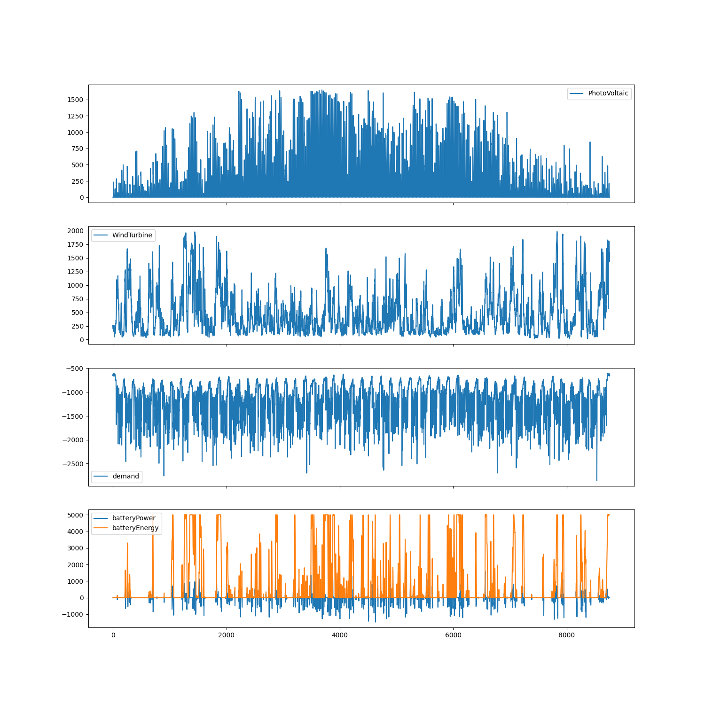

Peak Busters
===============

In today's rapidly evolving industrial landscape, efficient
energy management has become a critical focus for companies
aiming to optimize their production processes and reduce operational
costs. This application is designed to enhance the storage capacity
of batteries by intelligently selecting and integrating various renewable
energy resources.

Resources:
--------------

Solar Power:
............
Solar power is a significant renewable energy source that can
contribute substantially to energy needs. However, its availability
is subject to daily and seasonal variations, and it can be
significantly affected by cloud cover, making it an inconsistent power source.

Wind Power:
............
Wind energy is another robust renewable resource. While it can be a
reliable source under the right conditions, it also comes with its own
set of limitations, such as variability in wind speeds and geographic
dependencies.

Demand:
--------------
The energy demand of a building or facility can fluctuate based on
the nature and volume of the products being manufactured. Accurate
prediction of energy usage is crucial to optimize resource allocation
and ensure a seamless production process.

This package aims to address these challenges by integrating real-time
data and advanced algorithms to balance energy supply demand and storage
efficiently, leveraging the strengths of various renewable sources
to ensure a steady and reliable energy flow.

